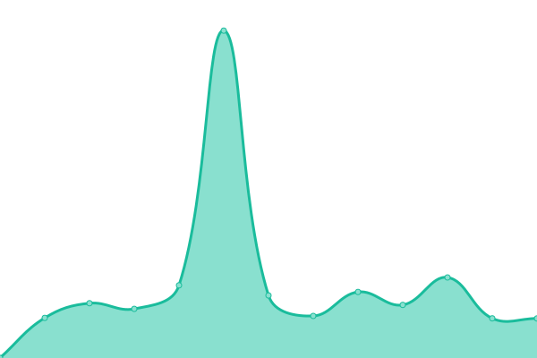

# [📈 Live Status](https://madhogs.github.io/upptime): <!--live status--> **🟧 Partial outage**

This repository contains the open-source uptime monitor and status page for [madhogs](https://madhogs.github.io/upptime), powered by [Upptime](https://github.com/upptime/upptime).

With [Upptime](https://upptime.js.org), you can get your own unlimited and free uptime monitor and status page, powered entirely by a GitHub repository. We use [Issues](https://github.com/madhogs/upptime/issues) as incident reports, [Actions](https://github.com/madhogs/upptime/actions) as uptime monitors, and [Pages](https://madhogs.github.io/upptime) for the status page.

<!--start: status pages-->
<!-- This summary is generated by Upptime (https://github.com/upptime/upptime) -->
<!-- Do not edit this manually, your changes will be overwritten -->
<!-- prettier-ignore -->
| URL | Status | History | Response Time | Uptime |
| --- | ------ | ------- | ------------- | ------ |
|  qBittorrent public | 🟥 Down | [q-bittorrent-public.yml](https://github.com/madhogs/upptime/commits/HEAD/history/q-bittorrent-public.yml) | 

 139ms
     
 | 

<a href="https://status.madhogs.dev/history/q-bittorrent-public">100.00%</a>
    

|  Monero public | 🟩 Up | [monero-public.yml](https://github.com/madhogs/upptime/commits/HEAD/history/monero-public.yml) | 

 132ms
     
 | 

<a href="https://status.madhogs.dev/history/monero-public">100.00%</a>
    

|  Tor bridge OR public | 🟩 Up | [tor-bridge-or-public.yml](https://github.com/madhogs/upptime/commits/HEAD/history/tor-bridge-or-public.yml) | 

 125ms
     
 | 

<a href="https://status.madhogs.dev/history/tor-bridge-or-public">100.00%</a>
    

|  Tor bridge PT public | 🟩 Up | [tor-bridge-pt-public.yml](https://github.com/madhogs/upptime/commits/HEAD/history/tor-bridge-pt-public.yml) | 

 125ms
     
 | 

<a href="https://status.madhogs.dev/history/tor-bridge-pt-public">100.00%</a>
    

|  [Vpn Proxy](oracle) | 🟩 Up | [vpn-proxy.yml](https://github.com/madhogs/upptime/commits/HEAD/history/vpn-proxy.yml) | 

 248ms
     
 | 

<a href="https://status.madhogs.dev/history/vpn-proxy">100.00%</a>
    

|  [Tor Proxy](oracle) | 🟩 Up | [tor-proxy.yml](https://github.com/madhogs/upptime/commits/HEAD/history/tor-proxy.yml) | 

 133ms
     
 | 

<a href="https://status.madhogs.dev/history/tor-proxy">100.00%</a>
    

|  qBitTorrent UI | 🟩 Up | [q-bit-torrent-ui.yml](https://github.com/madhogs/upptime/commits/HEAD/history/q-bit-torrent-ui.yml) | 

 567ms
     
 | 

<a href="https://status.madhogs.dev/history/q-bit-torrent-ui">100.00%</a>
    

|  Jellyfin UI | 🟩 Up | [jellyfin-ui.yml](https://github.com/madhogs/upptime/commits/HEAD/history/jellyfin-ui.yml) | 

 706ms
     
 | 

<a href="https://status.madhogs.dev/history/jellyfin-ui">100.00%</a>
    

|  Sonarr UI | 🟩 Up | [sonarr-ui.yml](https://github.com/madhogs/upptime/commits/HEAD/history/sonarr-ui.yml) | 

 570ms
     
 | 

<a href="https://status.madhogs.dev/history/sonarr-ui">100.00%</a>
    

|  Prowlarr UI | 🟩 Up | [prowlarr-ui.yml](https://github.com/madhogs/upptime/commits/HEAD/history/prowlarr-ui.yml) | 

 574ms
     
 | 

<a href="https://status.madhogs.dev/history/prowlarr-ui">100.00%</a>
    

|  Website | 🟩 Up | [website.yml](https://github.com/madhogs/upptime/commits/HEAD/history/website.yml) | 

 447ms
     
 | 

<a href="https://status.madhogs.dev/history/website">100.00%</a>
    

|  Website Subdomain | 🟩 Up | [website-subdomain.yml](https://github.com/madhogs/upptime/commits/HEAD/history/website-subdomain.yml) | 

 569ms
     
 | 

<a href="https://status.madhogs.dev/history/website-subdomain">100.00%</a>
    

<!--end: status pages-->

[**Visit our status website →**](https://madhogs.github.io/upptime)

## 📄 License

- Powered by: [Upptime](https://github.com/upptime/upptime)
- Code: [MIT](./LICENSE) © [madhogs](https://madhogs.github.io/upptime)
- Data in the `./history` directory: [Open Database License](https://opendatacommons.org/licenses/odbl/1-0/)
