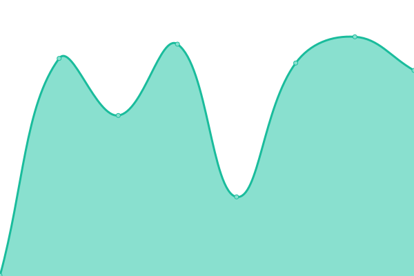
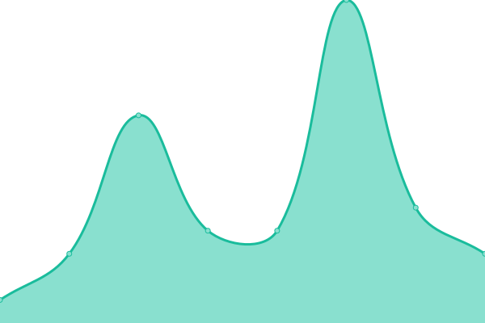

# [📈 Live Status](https://madhogs.github.io/upptime): <!--live status--> **🟧 Partial outage**

This repository contains the open-source uptime monitor and status page for [madhogs](https://madhogs.github.io/upptime), powered by [Upptime](https://github.com/upptime/upptime).

With [Upptime](https://upptime.js.org), you can get your own unlimited and free uptime monitor and status page, powered entirely by a GitHub repository. We use [Issues](https://github.com/madhogs/upptime/issues) as incident reports, [Actions](https://github.com/madhogs/upptime/actions) as uptime monitors, and [Pages](https://madhogs.github.io/upptime) for the status page.

<!--start: status pages-->
<!-- This summary is generated by Upptime (https://github.com/upptime/upptime) -->
<!-- Do not edit this manually, your changes will be overwritten -->
<!-- prettier-ignore -->
| URL | Status | History | Response Time | Uptime |
| --- | ------ | ------- | ------------- | ------ |
|  qBittorrent public | 🟥 Down | [q-bittorrent-public.yml](https://github.com/madhogs/upptime/commits/HEAD/history/q-bittorrent-public.yml) | 

 0ms
     
 | 

<a href="https://status.madhogs.dev/history/q-bittorrent-public">0.00%</a>
    

|  Monero public | 🟥 Down | [monero-public.yml](https://github.com/madhogs/upptime/commits/HEAD/history/monero-public.yml) | 

 0ms
     
 | 

<a href="https://status.madhogs.dev/history/monero-public">0.00%</a>
    

|  Tor relay public | 🟥 Down | [tor-relay-public.yml](https://github.com/madhogs/upptime/commits/HEAD/history/tor-relay-public.yml) | 

 0ms
     
 | 

<a href="https://status.madhogs.dev/history/tor-relay-public">0.00%</a>
    

|  [Vpn Proxy](oracle) | 🟥 Down | [vpn-proxy.yml](https://github.com/madhogs/upptime/commits/HEAD/history/vpn-proxy.yml) | 

 249ms
     
 | 

<a href="https://status.madhogs.dev/history/vpn-proxy">68.35%</a>
    

|  [Tor Proxy](oracle) | 🟥 Down | [tor-proxy.yml](https://github.com/madhogs/upptime/commits/HEAD/history/tor-proxy.yml) | 

 0ms
     
 | 

<a href="https://status.madhogs.dev/history/tor-proxy">0.00%</a>
    

|  qBitTorrent UI | 🟥 Down | [q-bit-torrent-ui.yml](https://github.com/madhogs/upptime/commits/HEAD/history/q-bit-torrent-ui.yml) | 

 0ms
     
 | 

<a href="https://status.madhogs.dev/history/q-bit-torrent-ui">0.00%</a>
    

|  Website | 🟩 Up | [website.yml](https://github.com/madhogs/upptime/commits/HEAD/history/website.yml) | 

 524ms
     
 | 

<a href="https://status.madhogs.dev/history/website">100.00%</a>
    

|  Website Subdomain | 🟩 Up | [website-subdomain.yml](https://github.com/madhogs/upptime/commits/HEAD/history/website-subdomain.yml) | 

 561ms
     
 | 

<a href="https://status.madhogs.dev/history/website-subdomain">100.00%</a>
    

<!--end: status pages-->

[**Visit our status website →**](https://madhogs.github.io/upptime)

## 📄 License

- Powered by: [Upptime](https://github.com/upptime/upptime)
- Code: [MIT](./LICENSE) © [madhogs](https://madhogs.github.io/upptime)
- Data in the `./history` directory: [Open Database License](https://opendatacommons.org/licenses/odbl/1-0/)
